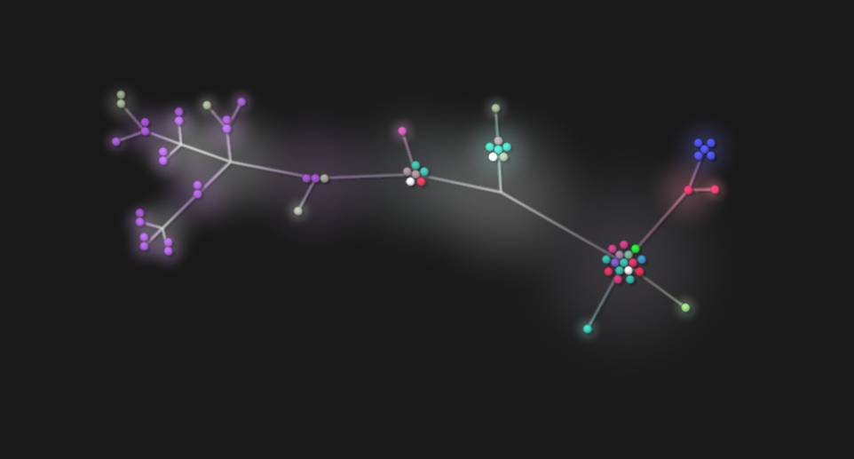

# Links for all the documentation files:

- [Basic usage of the app.](basic-usage.md)
- [Assets and code I don't own](assets-%26-code-i-dont-own.md)
- [Some resources for learning touch typing.](touch-typing.md)
- [Instalation guide](instalation.md)
- [About the app code and architecture](about.md)

# Project tree

## Old project tree from the online stage

