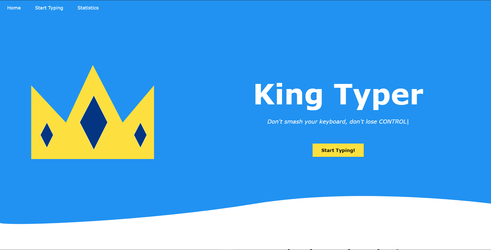
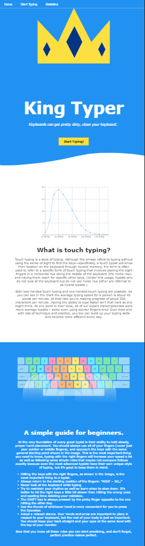
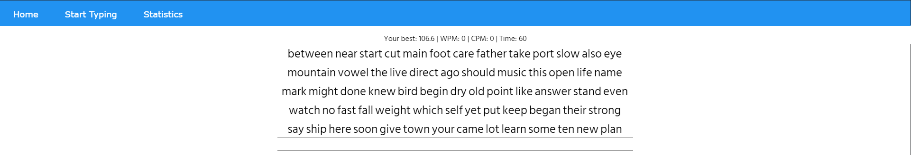
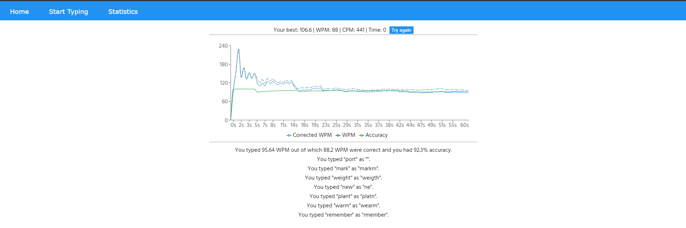
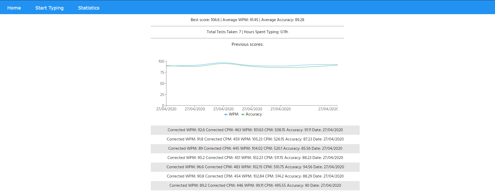

# Cum să utilizați aplicația.

Puteți utiliza versiunea găzduită a aplicației [aici](https://king-typer.herokuapp.com/) sau puteți instala aplicația și o puteți rula folosind [acest tutorial](blob/docs/docs/ro/tutoriale/instalare.md)

## Când deschideți aplicația, veți fi întâmpinat de acest ecran, care este `pagina principală`:

În partea de sus puteți vedea că aveți 3 butoane, precum și un buton sub titlul paginii.
Voi explica puțin mai târziu despre restul paginilor din aplicatie.

Primul lucru pe care îl veți vedea va fi sigla site-ului web, titlul, butoanele și textul rotativ animat.

Daca dati scroll mai jos, veți vedea că există un grafic cu o explicație despre tastarea tactilă.
Iar mai jos veți găsi un ghid foarte util despre cum să utilizați tastarea tactilă care include regulile de bază și câteva sfaturi mai avansate pe care le veți folosi de fiecare dată când veți face tastarea tactila.
În partea de jos veți găsi un subsol cu ​​un buton care redirecționează utilizatorul către aceast repository.

### Practic aceasta este întreaga pagină de pornire (din perspectiva unui telefon):

## Butoanele „Start Typing” vă vor aduce la aceeași pagină unde puteți da un test:

Este foarte simplu să începi testul, începi doar să tastezi în caseta de input, iar după ce introduci primul cuvânt, timerul va începe și ai 60 de secunde pentru a tasta cât mai multe cuvinte cu cea mai bună precizie pe care o poți avea, iar la sfârșitul testului veți vedea cât de bine v-ați descurcat:

În partea de sus veți vedea câteva informații simple despre testul dvs.:
- `Your best`: ceea ce înseamnă cel mai bun scor pe care l-ați avut în WPM (cuvinte pe minut)
- `WPM`: care este wpm-ul corectat, asta înseamnă cuvinte pe minut pe care le-ați scris corect
- `CPM`: care este cpm corectat, adică caractere pe minut care au fost scrise corect
- `Time`: care afișează timpul rămas, în acest caz este 0 becase testul s-a încheiat
- butonul `Try again`: care atuci cand este apasat, va reseta testul pentru a putea incepe un alt test.

Sub aceste informații, veți vedea un grafic care afișează `Precizia`,` WPM corectat`, `WPM necorectat` pentru o secundă a testului. Puteți trece cursorul pentru a vedea informațiile într-un mod mai bun pentru fiecare secundă. În acest fel puteți vedea modificări ale preciziei dvs., wpm, wpm necorectate, care au avut loc in test. Imediat sub grafic, veți vedea legenda pentru grafic.

Sub toate acestea, veți vedea unul dintre dintre:
- Un mesaj de felicitare îți spune că ai tastat corect toate cuvintele și îți spune care a fost scorul tău wpm.
- Un mesaj care vă spune care a fost WPM-ul dvs. necorectat și WPM-ul corectat împreună cu precizia dvs. pentru acel test și cuvintele pe care le-ați scris greșit și cum le-ați tastat.

## Butonul `Statistics` din bara de navigație vă va duce la pagina cu statistici:

Dacă nu ați făcut încă niciun test de dactilografiere, veți vedea un mesaj care vă spune că puteți vedea statistici doar dacă ați dat cel putin un test.
Dacă ați dat cel puțin un test de dactilografiere veți fi întâmpinat de această pagină:

Explicand totul de sus în jos:
- `Best Score`: este cel mai bun scor în WPM (wpm corectat), puteți vedea acest scor și pe pagina de tastare.
- `WPM mediu`: care este wpm-ul dvs. mediu pentru ultimele 10 teste. (wpm corectat)
- `Average Accuracy`: care este precizia dvs. medie pentru ultimele 10 teste.
- `Previous scores`: un grafic care vă va indica scorurile anterioare pe care le-ați avut. Acest grafic include WPM-ul dvs. (wpm-ul corectat) și precizia dvs. pentru fiecare test pe care l-ați dat în trecut. Astfel poți vedea cât de mult ai avansat, in timp.
- `O listă a scorurilor anterioare`: o listă cu scorurile anterioare care este sortată de la cele mai recente la cele mai vechi scoruri de test. Această listă va conține WPM corectat, CPM corectat, WPM, CPM, precizia și data testului.

## King Typer este destinat să fie utilizat cu o tastatură reală (nu cu o tastatură virtuală, de exemplu la telefon sau tabletă), deoarece încurajează tastarea tactilă și nu tastarea rapida pe telefon sau tabletă. Site-ul web poate fi utilizat pe telefon și tabletă și este responsive, dar nu este destinat acestei utilizări.